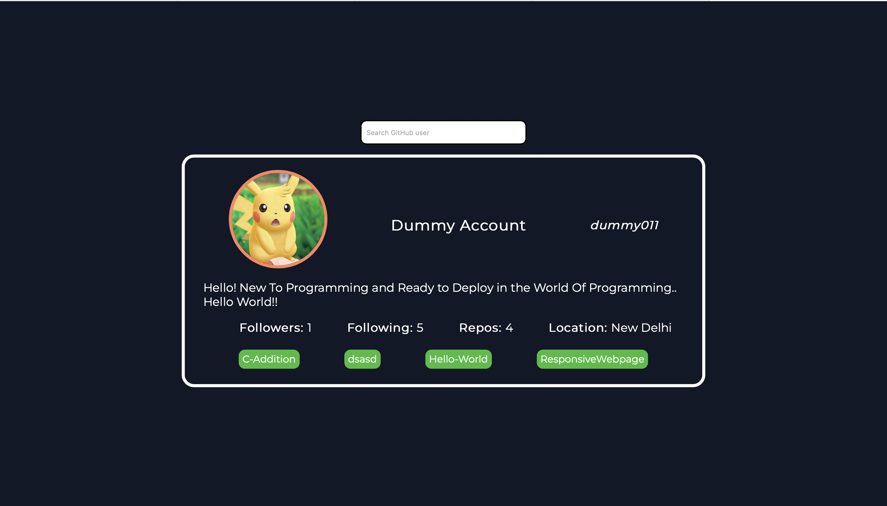

# GitHub-Profiler
A project for DevSoc Hackathon 

Find the website here: https://devsoc-mentos.github.io/GitHub-Profiler/index.html

## UI Design:

[Ankita Bisoi](https://github.com/KitVB)

Shourya Naik

## HTML, CSS, JS:

[Arjun Puthli](https://github.com/akagam1)

[Shanay Mehta](https://github.com/Shanay-Mehta)

## About the project:

Our project makes use of [GitHub's API](https://docs.github.com/en/rest) to collect user information. You can enter a GitHub username in the search bar and said user's information such as the number of followers, following, repositories as well as their bio and profile image will be displayed in the form of a card. 

## Learning Experience:
<ul>

<li>Git and GitHub workflow</li>
<li>UI design on Figma</li>
<li>DOM manipulation</li>
<li>Basics of asynchronous JavaScript and APIs</li>

</ul>

